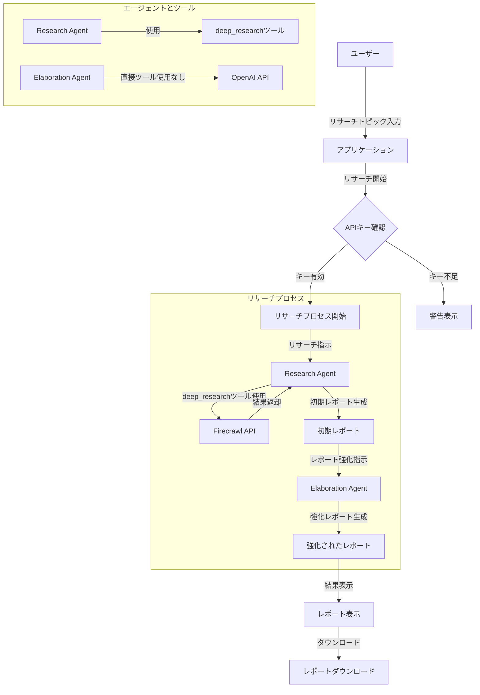

## リサーチエージェントアプリケーションの処理フロー解説

### 主要コンポーネント

1. **エージェント（2つ）**:
   - **Research Agent（Agent 1）**: リサーチを実行し、初期レポートを生成
   - **Elaboration Agent（Agent 2）**: 初期レポートを受け取り、内容を強化して最終レポートを生成

2. **ツール（1つ）**:
   - **deep_research**: Firecrawl APIを使用してウェブ検索と情報収集を行うツール
   - Research Agentのみがこのツールを使用

### 処理の流れ

1. **ユーザー入力**:
   - ユーザーがリサーチトピックを入力
   - 詳細設定（リサーチの深さ、時間制限、URL数）を調整可能

2. **APIキー確認**:
   - OpenAI APIキーとFirecrawl APIキーの有効性を確認
   - キーが不足している場合は警告を表示

3. **リサーチプロセス**:
   - **Research Agent（Agent 1）の実行**:
     - deep_researchツールを使用してウェブリサーチを実行
     - 収集した情報を分析して初期レポートを生成
   
   - **Elaboration Agent（Agent 2）の実行**:
     - 初期レポートを入力として受け取る
     - OpenAI APIを使用して内容を強化（追加情報、例、ケーススタディなど）
     - 強化されたレポートを生成

4. **結果表示**:
   - 強化されたレポートをUIに表示
   - レポートのダウンロード機能を提供

### データの流れ

- **ユーザー → アプリケーション**: リサーチトピックと設定
- **アプリケーション → Research Agent**: リサーチ指示とパラメータ
- **Research Agent → deep_researchツール → Firecrawl API**: ウェブリサーチリクエスト
- **Firecrawl API → Research Agent**: リサーチ結果
- **Research Agent → アプリケーション**: 初期レポート
- **アプリケーション → Elaboration Agent**: 初期レポートと強化指示
- **Elaboration Agent → アプリケーション**: 強化されたレポート
- **アプリケーション → ユーザー**: 最終レポート表示とダウンロード機能
